- 基于SpringBoot/SSM的物品租赁系统
- 预览地址：[http://doremi.liuyanzhao.com](http://doremi.liuyanzhao.com)
- 详细介绍地址：[https://liuyanzhao.com/shop/doremi.html](https://liuyanzhao.com/shop/doremi.html)
- 包含SpringBoot和SSM2个版本

## 一、功能介绍
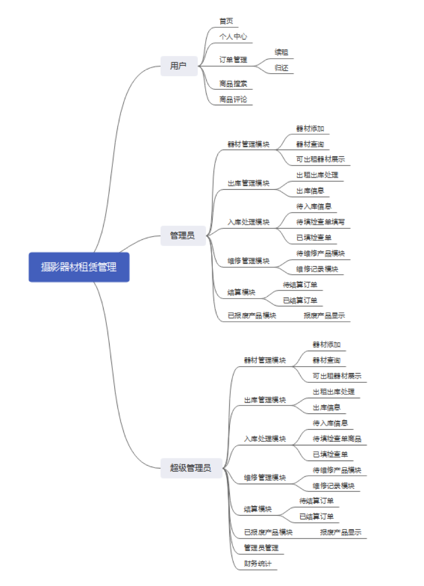

介绍下主要功能
1. 用户根据开始日期和结束日期预定器材，创建订单，完成支付
2. 需要管理员审核订单，审核通过后，会自动添加待出库信息
3. 管理员在待出库信息里进行发货，填写物流信息；可以查看出库记录
4. 用户可以进行确认收货
5. 用户可以续借，只能续借一次，最多续借7天
6. 用户可以归还器材，填写物流信息，会自动添加待入库信息
7. 管理员在待入库信息里确认收货，会自动添加待检查信息(需要检测物品是否损坏)
8. 管理员在待检查清单里填写检查结果，如果检测状态为异常，会自动添加待维修信息；检查正常，会新增待结算信息
9. 管理员可以在待维修信息里填写维修结果，如果维修结论是没有修好，物品状态会改成报废，会新增待结算信息
10. 管理员在待结算信息里填写结算金额(押金-逾期金额-续借金额-维修金额)和备注，会自动显示理算公式和金额，具体如下图
11. 超管可以在财务统计里看到收支统计

## 二、技术组成
- 1、SpringBoot 或 SSM
- 2、MyBatis
- 3、Thymeleaf
- 4、Bootstrap
- 5、MySQL

## 三、项目截图
1-首页1.png

2-首页2.png
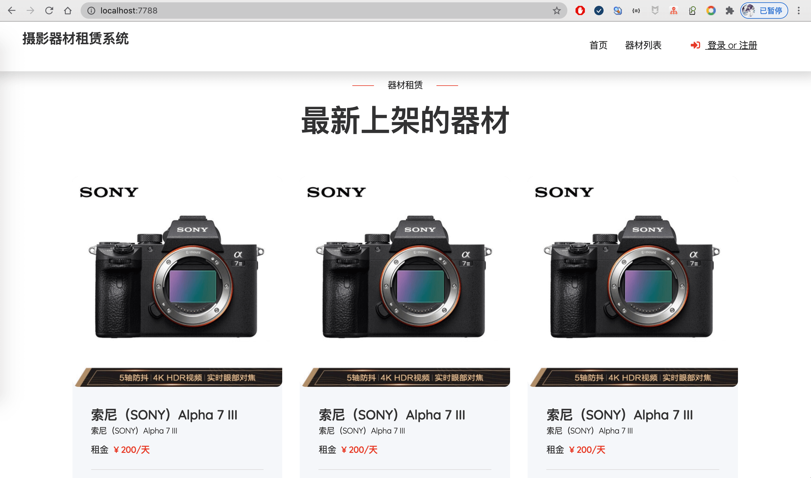
3-详情页1.png

4-详情页2.png
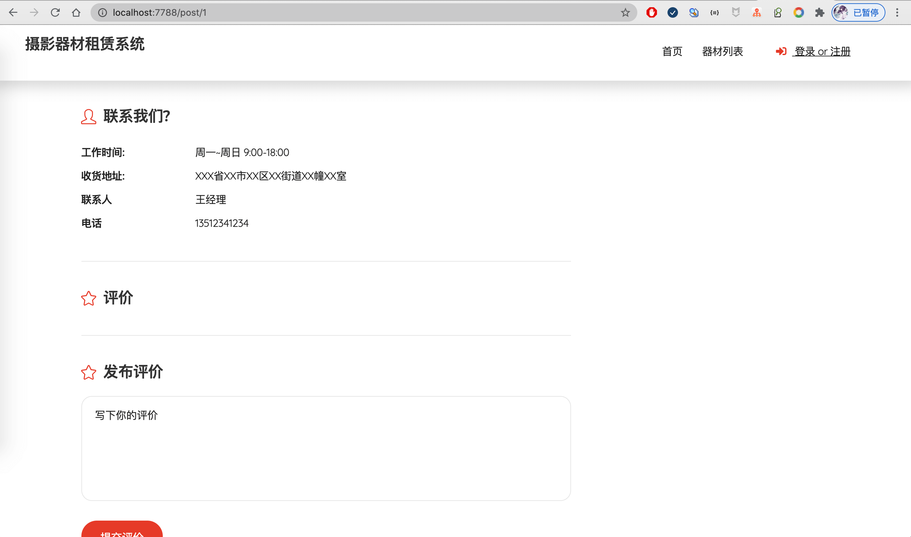
5-登录注册.png

6-预定.png
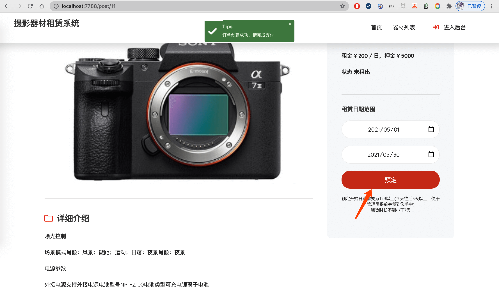
7-支付页面.png
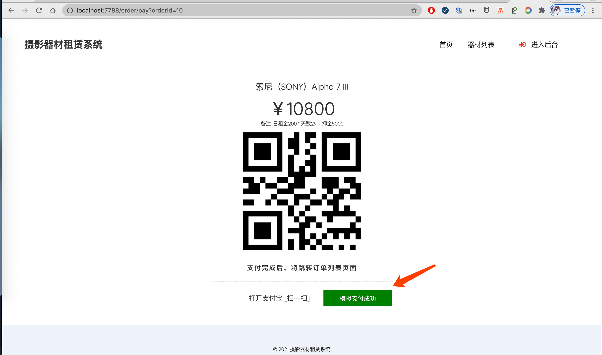
8-待审核订单.png

9-管理员审核订单.png
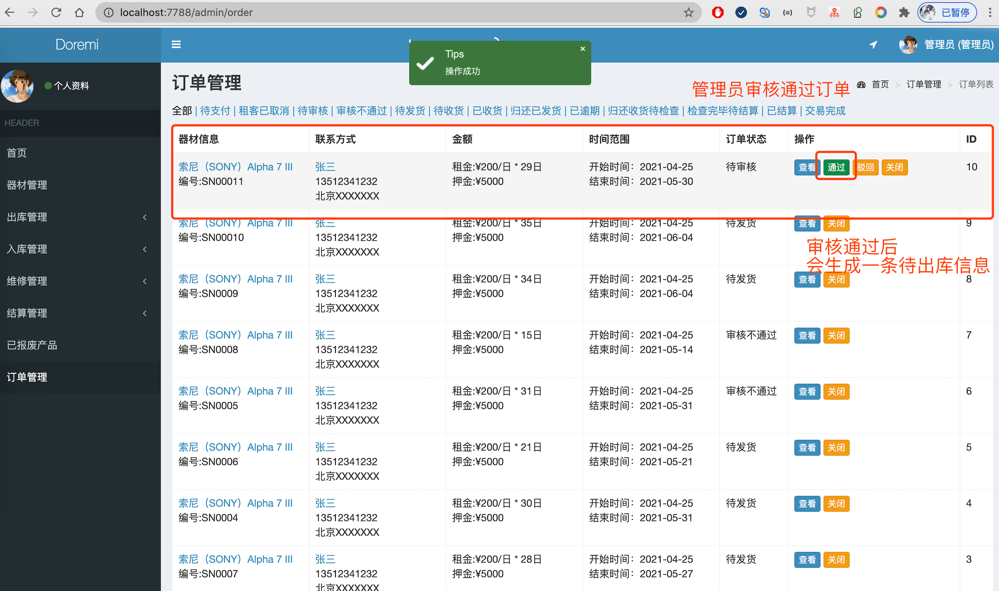
10-待出库列表.png

11-填写发货信息.png
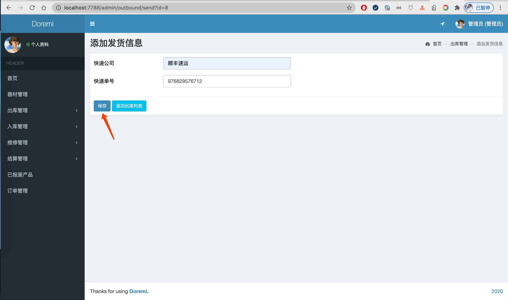
12-确认收货.png

13-订单列表(续借和归还选择).png
.png)
14-续借.png
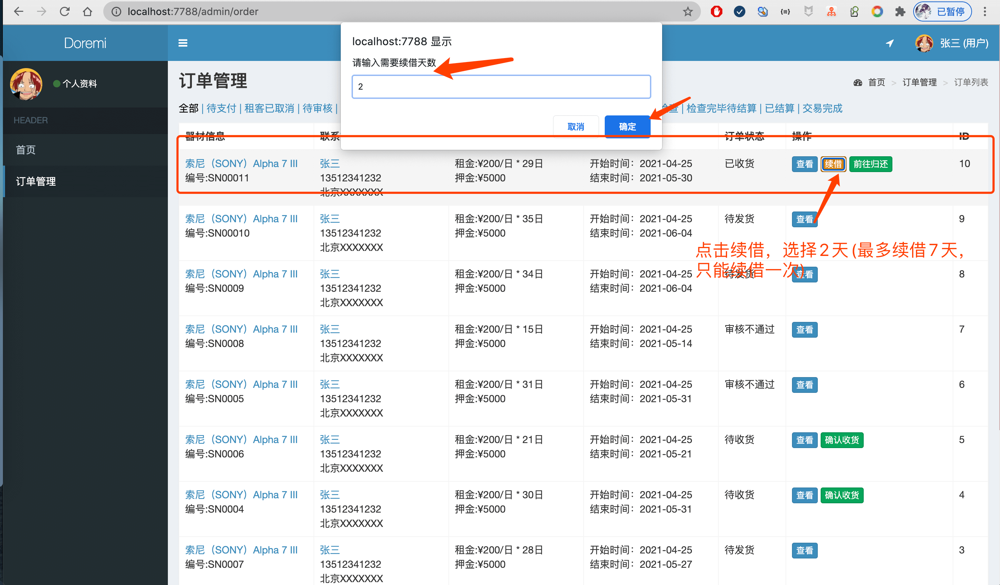
15-归还.png

16-待入库信息.png
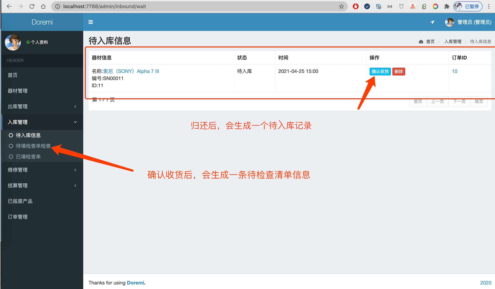
17-待检查清单信息.png

18-器材收货后检查.png
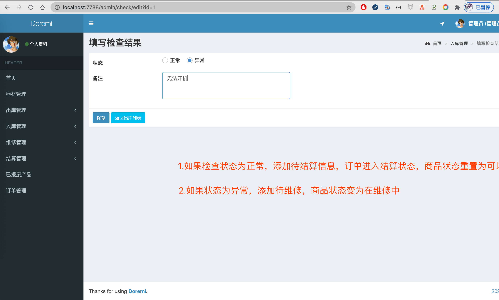
19-待维修记录.png

20-填写维修结果信息.png

21-维修记录.png

22-待结算订单.png

23-填写结算信息.png

24-已结算订单.png

25-订单详情1.png
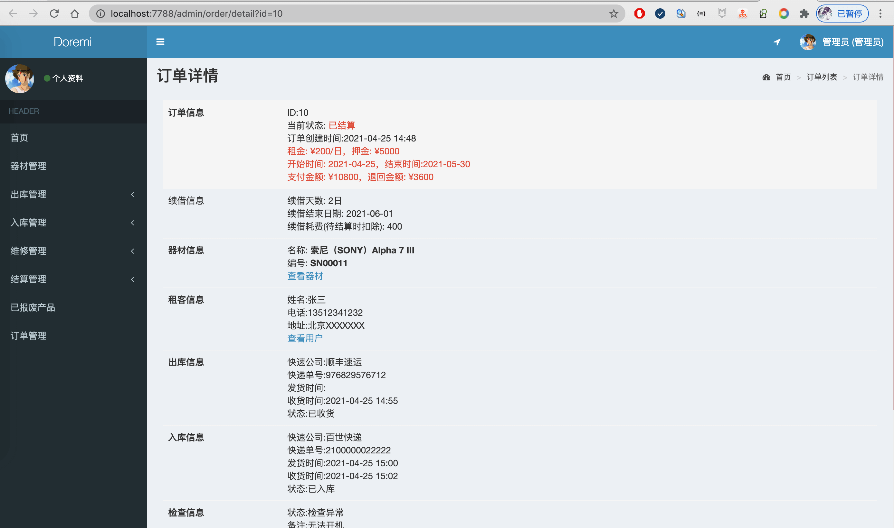
26-订单详情2.png
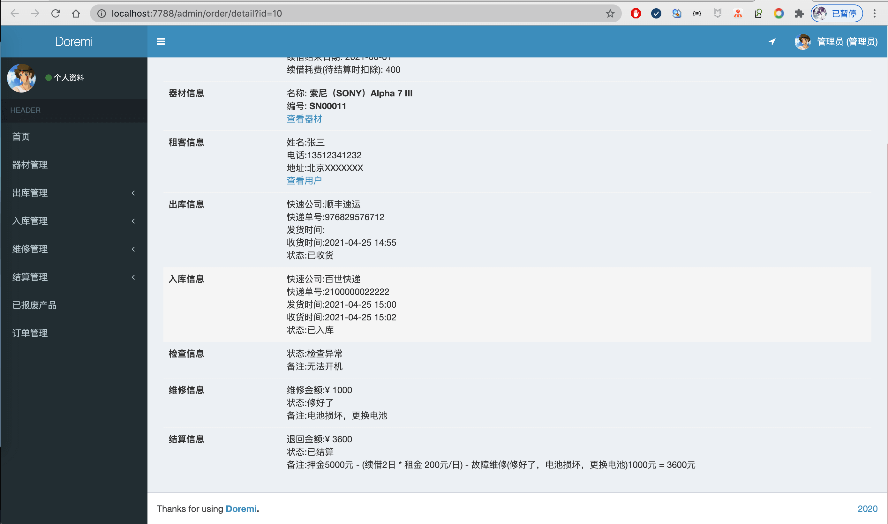
27-器材管理.png

28-器材添加编辑.png
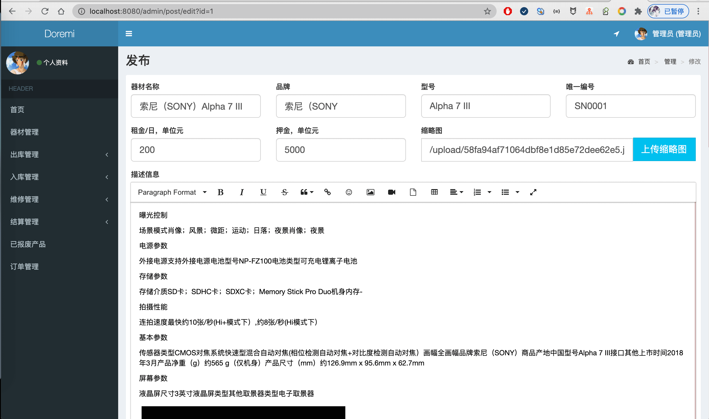
29-财务统计.png
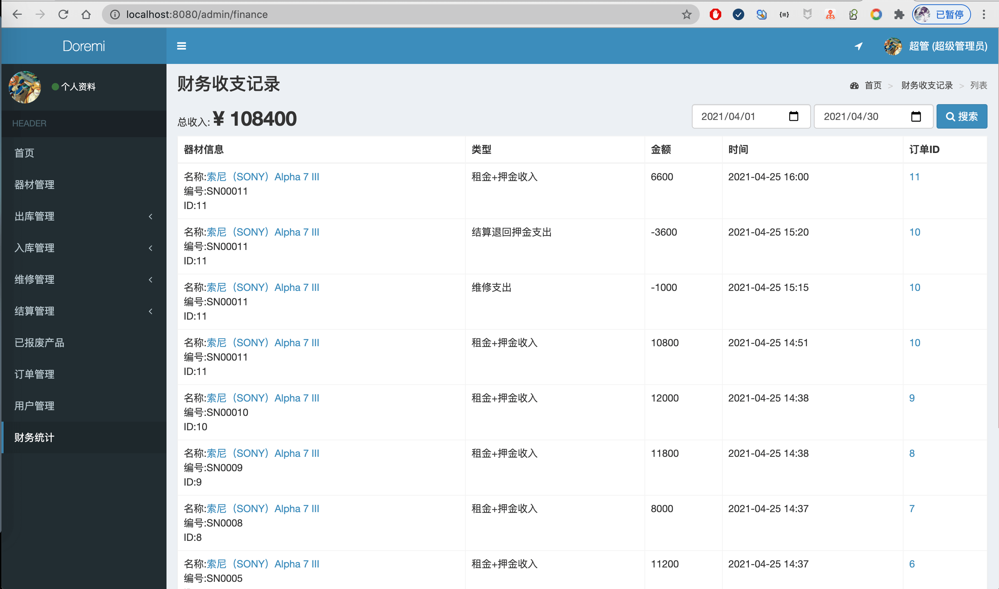
30-已报废产品.png

## 四、联系方式
需要完整代码联系博主，微信847064370

